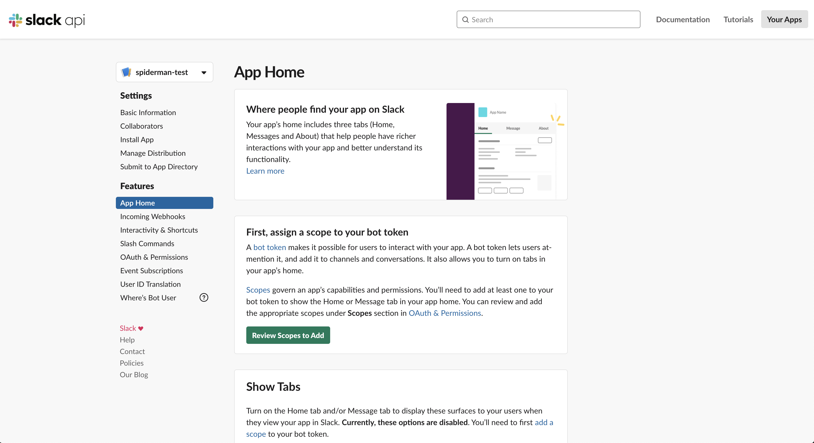
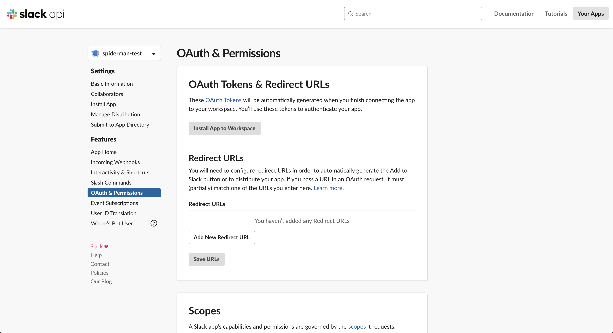
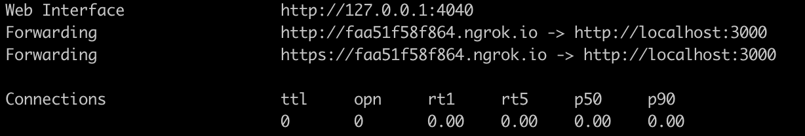
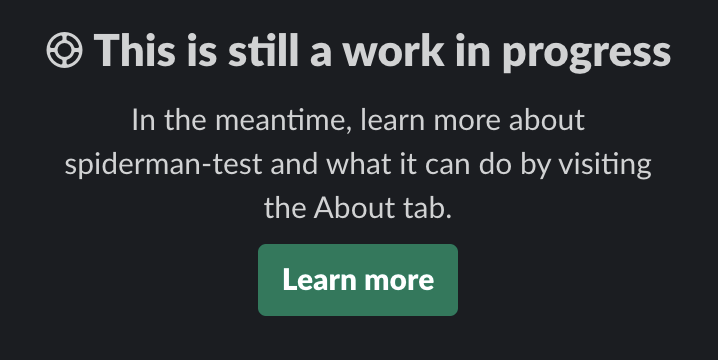
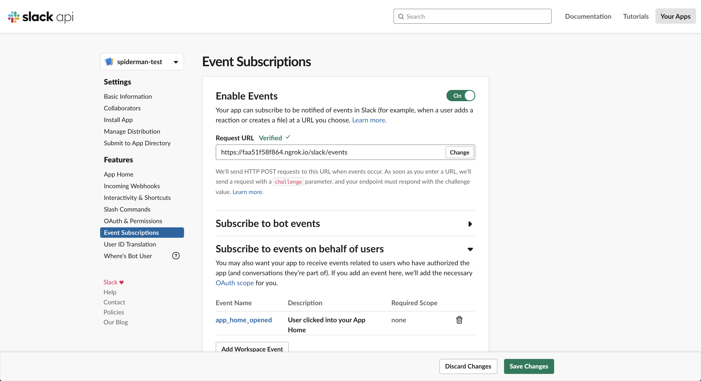
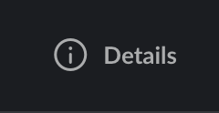

[Back to README](README.md)

In this section you can find a guide on how to setup the project locally,
develop your solution and contribute to our project. If it is your first time
contributing to an Open Software project you might find this
[guide](https://opensource.guide/how-to-contribute/) helpful too.

### Run the app locally

You can do the following steps to run the app locally from within your root
folder:

```sh
$ git clone https://github.com/GeoDoo/post-your-standup.git
$ cd post-your-standup
$ cp .env.example .env
$ npm install
$ npm start
```

This will create a new `.env` file that you will need to fill in with the
appropriate values and start the development server at the port 3000. If you
want to change ports you can specify your preference as PORT environment
variable in your local `.env` file.

The next step is crucial for your being able to develop something because it
requires that you have your own workspace or use our common one by
[joining geodoo Slack workspace](https://join.slack.com/t/geodoo/shared_invite/zt-fcn7iygw-F05NMjqmv42GTh6TRKTBOA).
In any case, you will also need to create a _"test app"_ that you will use
instead of the production one which runs on the actual server. If you go with
the solution to join our workspace we recommend a name for your app (and bot
user) like the following, e.g `geodoo-test`:

```
<your username for geodoo workspace>-test
```

This means that if your username is like `spiderman`, then we recommend you name
your app `spiderman-test`.

At this point, we will guide you through how to create a test Slack app:

#### When you click on `Create a new app` button you are going to see and fill in something like this:

<p align="center">
  
</p>

You then hit `Create app` button.

#### You will see a screen like this:

<p align="center">
  
</p>

In the current page you will need to find your `Signing secret` and fill in the
designated variable in your `.env` file.

<p align="center">
  
</p>

#### Navigate to `App Home`

You should see this:

<p align="center">
  
</p>

Click on the `Review Scopes to Add` button. You will redirect to
`OAuth & Permissions` page.

#### OAuth & Permissions:

<p align="center">
  
</p>

Scroll down to the `Bot Token Scopes` section and add the following scopes (we
will try to keep this part updated with any future additions):

- `channels:read`
- `chat:write`
- `commands`
- `groups:read`

A big green button `Install App to Workspace` will appear at the top of the
page. Go ahead and install the app.

Also, when you redirect to this page after the installation, you can see your
`Bot User OAuth Access Token`. Copy that to your `SLACK_BOT_TOKEN` environment
variable to your local `.env` file.

#### Go back to `App Home`

**Enable** `Always Show My Bot as Online` and `Home Tab` options and **disable**
`Messages Tab`.

So, now it is the time for you to expose your localhost to the internet. You
will need a public URL. One of the best tools around is
[ngrok.com](https://ngrok.com/). After you install it, try running:

```sh
$ ./ngrok http 3000
```

from the folder you have it installed (unless you followed the instructions to
set it up from any folder).

This command will give something like this:

<p align="center">
  
</p>

Now, copy one of the URLs (maybe the https is preferred) and paste it somewhere
like this:

```
https://faa51f58f864.ngrok.io/slack/events
```

`/slack/events` is the default endpoint in a `bolt-js` application like ours.

#### Go to `Interactivity & Shortcuts`

Paste the above URL to `Request URL` field and save changes.

#### Go to `Event Subscriptions`

This part sometimes is tricky (you might forget some configuration option etc.
so do not give up if is does not work with the first attempt). Enable events and
paste the URL again. You will probably see that verification failed and a
`Retry` button. Scroll down to the `Subscribe to events on behalf of users`
section, search for and add the `app_home_opened` workspace event. If you were
curious and tried to visit your bot's homepage you would have seen a loading
icon and after a while a message like the following:

<p align="center">
  
</p>

Retry with the URL and you will see when successful:

<p align="center">
  
</p>

Save your changes! Now, your bot's homepage should work properly!

#### Last page to setup: `Slash Commands` Last bit to setup is the custom
command section. Nothing crazy, just follow the instructions (URL is the same as
before) and please we recommend you write your command like this:

```
/standup-<your username's initial or more characters or your username>
```

This is to keep things clear and separate for all contributors. For example, our
`spiderman` command should be like `/standup-s` or `/standup-sp` or
`/standup-spidy` etc so it can be unique but relevant to original `/standup`
one.

And this part concludes the proper setup of your local personal test app!!

Treat yourself with some beverage or beer!! :coffee: :tea: or :beers: or even
:sake:

#### Test your app in the workspace Go to `#work` channel and open the channel's
details sidebar by clicking on Details button, top right:

<p align="center">
  
</p>

You will see a More link and there an option `Add apps`. Find and install
`spiderman-test` in the channel. You are ready to test it. Try the command:

```sh
/standup-s
```

You should get your standup, but wait it is not possible yet. Because...

#### Get a JIRA account

You will need an Atlassian account of course and an
[API token](https://confluence.atlassian.com/cloud/api-tokens-938839638.html)
for your account for basic authentication.

When you are done you will need to go to your bot's Homepage and setup JIRA over
there through the settings you will provide.

Finally, when your JIRA basic authentication is done correctly, you will need to
go back to the `#work` channel, where you install the app (remember?) and run:

```
/standup-s
```

Then and only then, you will be able to post your beautifully designed standup
to the channel for everyone to admire your progress!!

More beers please :beers: :beers: :beers:

Apart from all the above, you will need to fork the project, do your changes and
open a PR from your fork to this repo. Please check here on how to do that:
https://help.github.com/en/github/getting-started-with-github/fork-a-repo

Also, please check Issues tab first and work on an existing one or open a new
one if you think so, but when you open a PR, please link the issue on the
sidebar to the right. Check here for more info:
https://help.github.com/en/github/managing-your-work-on-github/linking-a-pull-request-to-an-issue

### Develop your solution

### Useful links

- [https://github.com/slackapi/bolt-js](https://github.com/slackapi/bolt-js)
- [https://slack.dev/bolt-js/tutorial/getting-started](https://slack.dev/bolt-js/tutorial/getting-started)
- [https://api.slack.com/start/building](https://api.slack.com/start/building)
