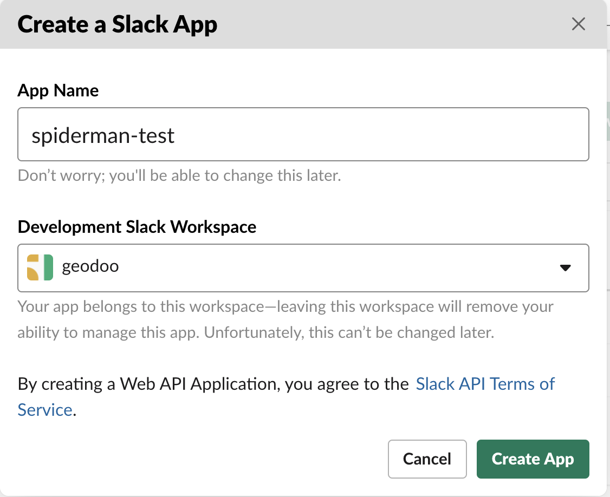
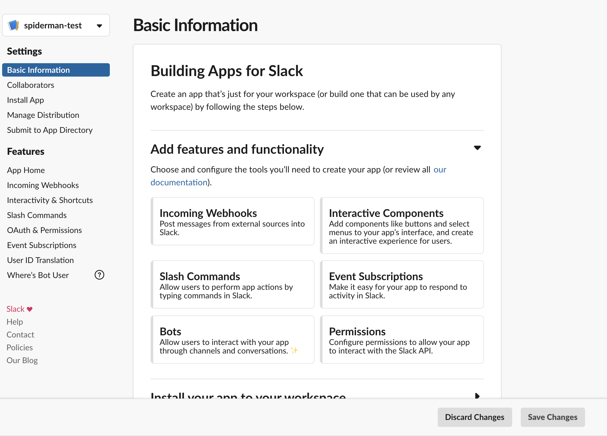
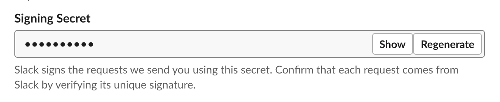

### Welcome to our app

In this section you can find a guide on how to setup the project locally, develop your solution and contribute to our project.

### Run the app locally

You can do the following steps to run the app locally from within your root folder:

```sh
$ git clone https://github.com/GeoDoo/post-your-standup.git
$ cd post-your-standup
$ cp .env.example .env
$ npm install
$ npm start
```

This will create a new `.env` file that you will need to fill in with the appropriate values and start the development server at the port 3000. If you want to change ports you can specify your preference as PORT environment variable in your local `.env` file.

The next step is crucial for your being able to develop something because it requires that you have your own workspace or use our common one by [joining geodoo Slack workspace](https://join.slack.com/t/geodoo/shared_invite/zt-fcn7iygw-F05NMjqmv42GTh6TRKTBOA). In any case, you will also need to create a _"test app"_ that you will use instead of the production one which runs on the actual server. If you go with the solution to join our workspace we recommend a name for your app (and bot user) like the following, e.g `geodoo-test`:

```
<your username for geodoo workspace>-test
```

This means that if your username is like `spiderman`, then we recommend you name your app `spiderman-test`.

At this point, we will guide you through how to create a test Slack app:

1. When you click on `Create a new app` button you are going to see and fill in something like this:

<p align="center">
  
</p>

You then hit `Create app` button

2. You will see a screen like this:

<p align="center">
  
</p>

3. In the current page you will need to find your `Signing secret` and fill in the designated variable in your `.env` file.

<p align="center">
  
</p>

4. Navigate to

5. You will need a public URL. Try exposing your localhost with [ngrok.com](https://ngrok.com/). When you have it, you will need to change the URL on the slack app settings under Events subscriptions page to point to yours (this is not convenient, but we currently don't have a proper host for the app). For local development I guess it will do for now
6. You will need certain env variables to setup the project
7. You will need an Atlassian account of course and an API token for your account for basic authentication. Check: https://confluence.atlassian.com/cloud/api-tokens-938839638.html

Apart from all the above, you will need to fork the project, do your changes and open a PR from your fork to this repo. Please check here on how to do that: https://help.github.com/en/github/getting-started-with-github/fork-a-repo

Also, please check Issues tab first and work on an existing one or open a new one if you think so, but when you open a PR, please link the issue on the sidebar to the right. Check here for more info: https://help.github.com/en/github/managing-your-work-on-github/linking-a-pull-request-to-an-issue

### Develop your solution

### Useful links

1. [https://github.com/slackapi/bolt-js](https://github.com/slackapi/bolt-js)
2. [https://slack.dev/bolt-js/tutorial/getting-started](https://slack.dev/bolt-js/tutorial/getting-started)
3. [https://api.slack.com/start/building](https://api.slack.com/start/building)
